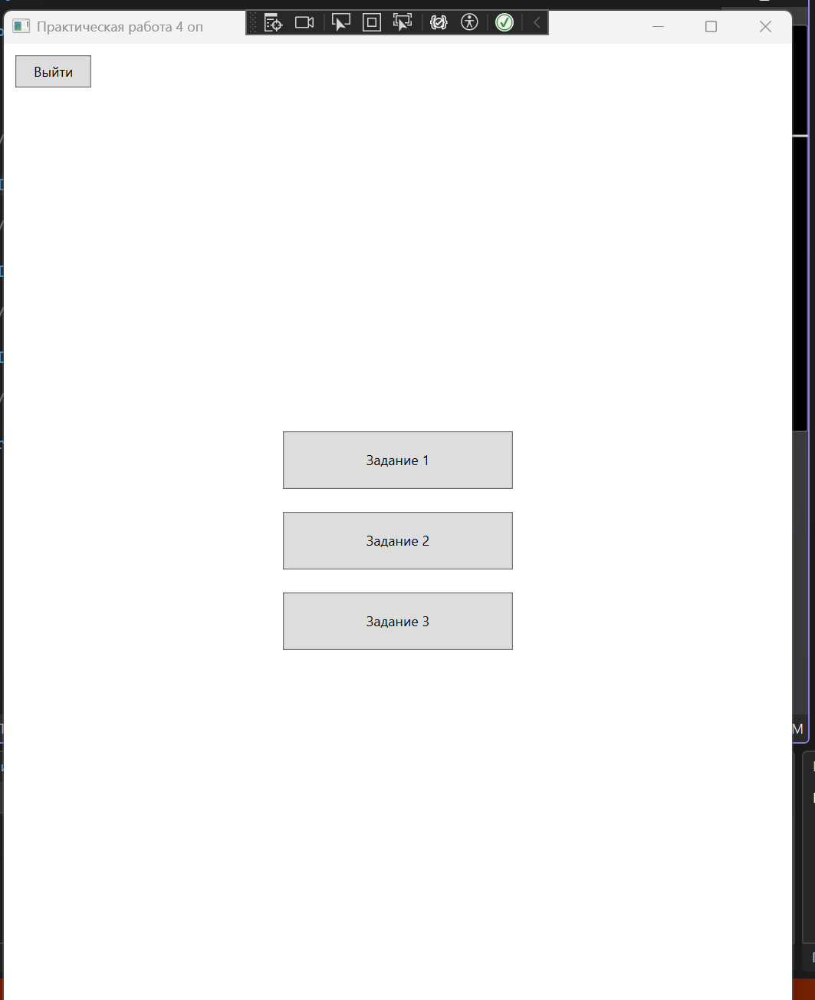
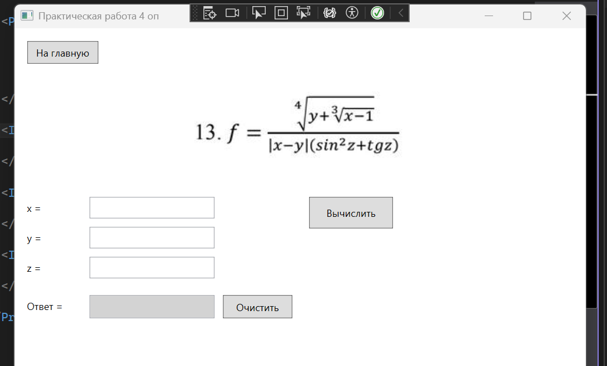
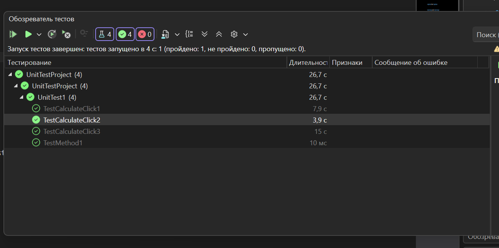

# Практическая работа 6, часть 2 - Поддержка и тестирование программных модулей - Оп. Н.

## Цель работы
Приобрести практические навыки ручного тестирования методом "белого ящика".

## Скриншоты

## Вывод
В рамках данной работы были повторены все пункты практического "ликбеза", выполнено практическое задание на основе опыта "ликбеза", все тесты, в том числе написанные в качестве практического задания, завершаются успешно (если запускаются по отдельности, при параллельном исправлении возникает состояние гонки, которое мне лень исправлять). Был проведён рефакторинг фукнций подсчёта, в том числе они сделаны публичными, а также для первой формулы были убраны переменные t и g, которые должны были быть вызовом функции тангенса.
